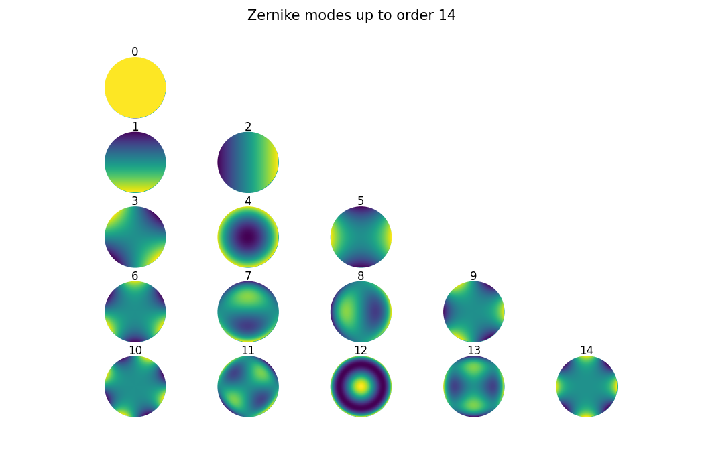

_ZernikePy_ is a minimalistic Python library to compute and visualize Zernike polynomials of any given orders.
A typical usage is to generate basis functions for phase modulation in optics.

# Installation
```
pip install ZernikePy
```

# Requirements
```
numpy
scipy
matplotlib
```

# How to use
After installation, first import the main function from the library
```
from zernikepy import zernike_polynomials
```

## Examples
Generate a (256, 256)-sized Zernike polynomial of order 4 (defocusing):
```python
p = zernike_polynomials(mode=4, size=256)
```
or
```python
p = zernike_polynomials(mode='defocusing', size=256)
```
Generate the first 15 modes and display them:
```python
ps = zernike_polynomials(mode=14, select='all', show=True)
```


Generate the following selected modes defocusing, vertical coma, oblique astigmatism and
display them:
```python
ps = zernike_polynomials(mode=10, select=[4, 'vertical coma', 'oblique astigmatism'], show=True)
```
Note that regardless of the order of the elements in the list `select`, the output stores the polynomials in ascending 
order in the last dimension. Hence, in the output `ps[:, :, 0]` is oblique astigmatism, `ps[:, :, 1]` is defocusing and 
`ps[:, :, 2]` is vertical coma.

## Detailed explanation
The main function `zernike_polynomials(mode, size, select, show)`
takes four variables:
- `mode`: which (or up to which) order of the polynomial. It follows the [OSA standard indexing](https://en.wikipedia.org/wiki/Zernike_polynomials#OSA/ANSI_standard_indices) convention 
and should be a nonnegative integer. It is also possible to pass a string of the corresponding name for the first 15 modes. Default is `'defocus'`.
- `size`: numerical size of the square Cartesian mesh. It should be a postive integer. Default is `128`.
- `select`: in the case of passing more than one polynomial, i.e. some selected modes up to the given `mode`,
give a list of integers or strings or a mixture of both. A special case is `select='all'` where all the polynomials up to
the given `mode` is passed. Default is `None` in which case only a single polynomial of the given `mode` is passed.
- `show`: boolen variable to determine whether to display the polynomials. Default is `False`.

The output is a Numpy array, either 2D for a single mode, or 3D for multiple modes.

### Name of the first 15 modes

| Mode / OSA index |              Name              |
|------------------|:------------------------------:|
| 0                |             piston             |
| 1                |         vertical tilt          |
| 2                |        horizontal tilt         |
| 3                |      oblique astigmatism       |
| 4                |            defocus             |
| 5                |      vertical astigmatism      |
| 6                |        vertical trefoil        |
| 7                |         vertical coma          |
| 8                |        horizontal coma         |
| 9                |        oblique trefoil         |
| 10               |       oblique quadrafoil       |
| 11               | oblique secondary astigmatism  |
| 12               |       primary spherical        |
| 13               | vertical secondary astigmatism |
| 14               |      vertical quadrafoil       |

